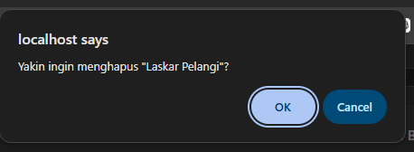

# LAPORAN JOBSHEET 5

**Nama:** Muhammad Farhan  
**NIM:** 264107027002  
**Kelas:** TI 2G  
**No:** 14

## Jobsheet 5 — JavaScript DOM & Event
Sub-CPMK: Menerapkan manipulasi DOM & event JavaScript.

## Perubahan dari Jobsheet 4
- Tambah `assets/js/app.js`.
- Hamburger menu: checkbox hack (CSS) diganti tombol + JS (`nav.classList.toggle("nav-open")`).

- Form Tambah Buku & Tambah Anggota: validasi client-side (`initValidasiForm`) — field wajib, rentang tahun, stok non-negatif — pesan error tampil inline via manipulasi DOM (`insertAdjacentElement`).

- Tabel Daftar Buku & Daftar Anggota: kolom pencarian real-time (`initTableFilter`) yang menyaring baris via `keyup`.

- Tombol Hapus (`.btn-hapus`): menampilkan `confirm()` lalu menghapus baris dari tampilan (masih front-end saja, belum ke server).

 
 
